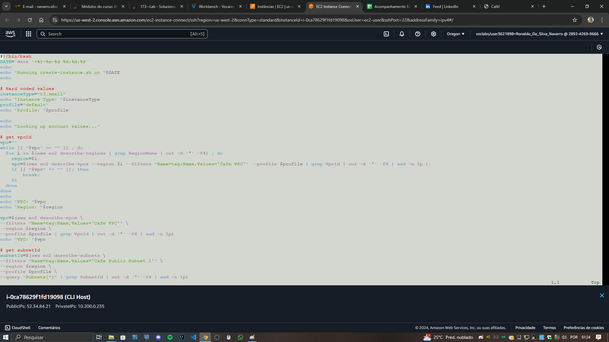

# 🌐 **Configuração de uma Pilha LAMP na AWS EC2**

Este repositório contém os arquivos e scripts relacionados ao laboratório **"Solucionar problemas com a criação de uma instância do EC2"**, parte da formação AWS re/Start. O objetivo foi configurar uma instância do EC2 com a pilha LAMP (Linux, Apache, MariaDB e PHP) e solucionar problemas no processo de implementação.

---

## 🗂️ **Conteúdo do Repositório**
- **Diagramas e imagens do processo**: Representam a arquitetura e o funcionamento do ambiente configurado.
- **Script de configuração**: Utilizado para provisionar e configurar os serviços na instância EC2.
- **Resultados do projeto**: Capturas de tela com as evidências do ambiente configurado e funcional.

---

## 📜 **Descrição do Laboratório**

### 🔹 **Objetivo**  
Criar uma instância EC2 configurada com os seguintes serviços:  
- Apache (Servidor Web)  
- MariaDB (Banco de Dados)  
- PHP (Para processar scripts dinâmicos)  

### 🔹 **Etapas Principais**  
1. **Configuração da arquitetura**: Criar e configurar a instância utilizando um script bash.  
2. **Solução de problemas**: Identificar e corrigir erros no script de configuração.  
3. **Teste do ambiente**: Validar que o servidor web e os aplicativos estão funcionando corretamente.

---

## 🖼️ **Imagens do Processo**

### **Diagrama de Arquitetura**


### **Script de Configuração**


### **Resultado do Ambiente - Página Hello Server**


### **EC2 Cafe Server**


### **Cafe Server**


### **Resultado Final - Página Café**


---

## 🛠️ **Como Reproduzir o Ambiente**

### Pré-requisitos:
- Conta na AWS.
- Familiaridade com a AWS CLI e o Console de Gerenciamento da AWS.

### Passos:
1. Faça o upload do script para uma instância EC2 já configurada.
2. Conceda permissões para o script com:  
   ```bash
   chmod +x script.sh
3. Execute o script para configurar os serviços:
    ```bash
    ./script.sh
4. Valide o funcionamento acessando o IP público da instância no navegador.


## 🎯 Resultados
Após seguir os passos e corrigir erros no script, a aplicação foi executada com sucesso. O servidor exibiu as páginas configuradas e os serviços estavam operacionais.