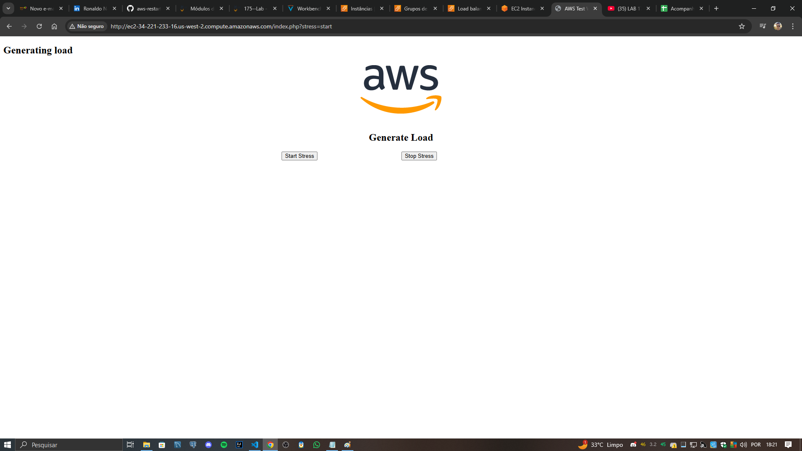

# Usar Auto Scaling na AWS (Linux)  

Este repositório contém o passo a passo do laboratório **"Usar Auto Scaling na AWS (Linux)"**, realizado durante a formação AWS re/Start. O objetivo foi configurar um ambiente escalável e resiliente utilizando Auto Scaling e Load Balancers na AWS.  

## Objetivo  

Aprender a configurar o Auto Scaling, criar um Elastic Load Balancer (ELB) e gerenciar um ambiente dinâmico que ajusta automaticamente os recursos com base na demanda.  

---

## Arquitetura  

### Arquitetura Inicial  
O ambiente começa com uma única instância configurada para hospedar um servidor web.  
  

### Arquitetura Final  
O resultado é um ambiente escalável, resiliente e balanceado, com instâncias gerenciadas pelo Auto Scaling e o tráfego distribuído pelo Elastic Load Balancer.  
  

---

## Passos Realizados  

1. **Criação de uma Instância EC2:**  
   Configurada com um servidor web (Apache) para atender às solicitações.  
     

2. **Criação de uma Amazon Machine Image (AMI):**  
   Personalizei a instância original para criar uma AMI que seria usada no Auto Scaling.

3. **Configuração do Elastic Load Balancer (ELB):**  
   Foi configurado um ELB para distribuir o tráfego entre instâncias em várias zonas de disponibilidade.  
     

4. **Implementação do Amazon EC2 Auto Scaling:**  
   - Criação de políticas de escalonamento para aumentar ou diminuir o número de instâncias conforme a demanda.  
   - Configuração de grupos de Auto Scaling.  
     

5. **Definição de Grupos de Destino:**  
   Configuração de destinos específicos para o tráfego roteado pelo ELB.  
     

6. **Geração de Carga de Trabalho:**  
   Simulação de tráfego para testar as políticas de Auto Scaling.  
     

---

## Sobre o Auto Scaling  

O Amazon EC2 Auto Scaling é uma funcionalidade que ajusta automaticamente a quantidade de instâncias de acordo com a demanda. Isso resulta em maior eficiência operacional e economia de custos, pois os recursos são escalados durante picos de tráfego e reduzidos em momentos de baixa atividade.